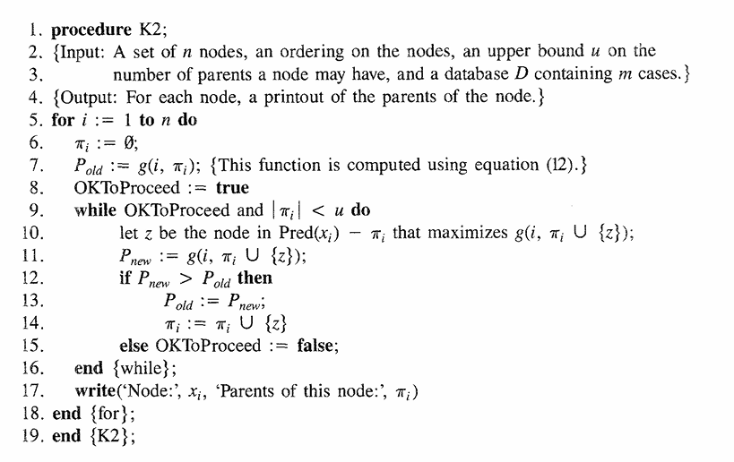
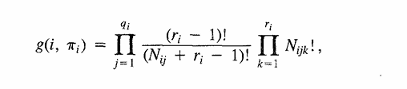
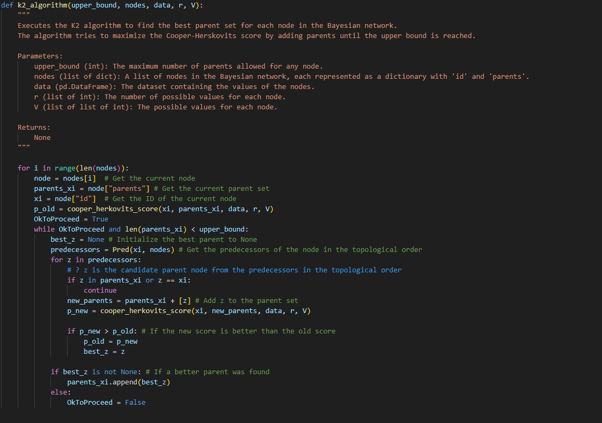
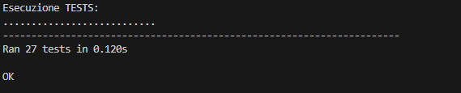
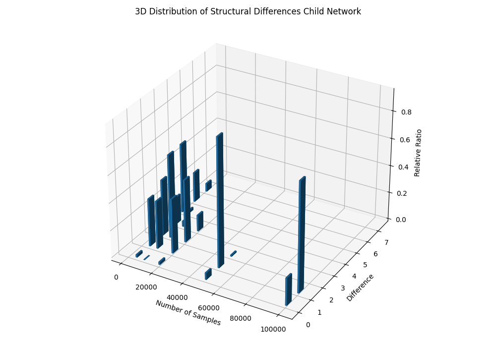
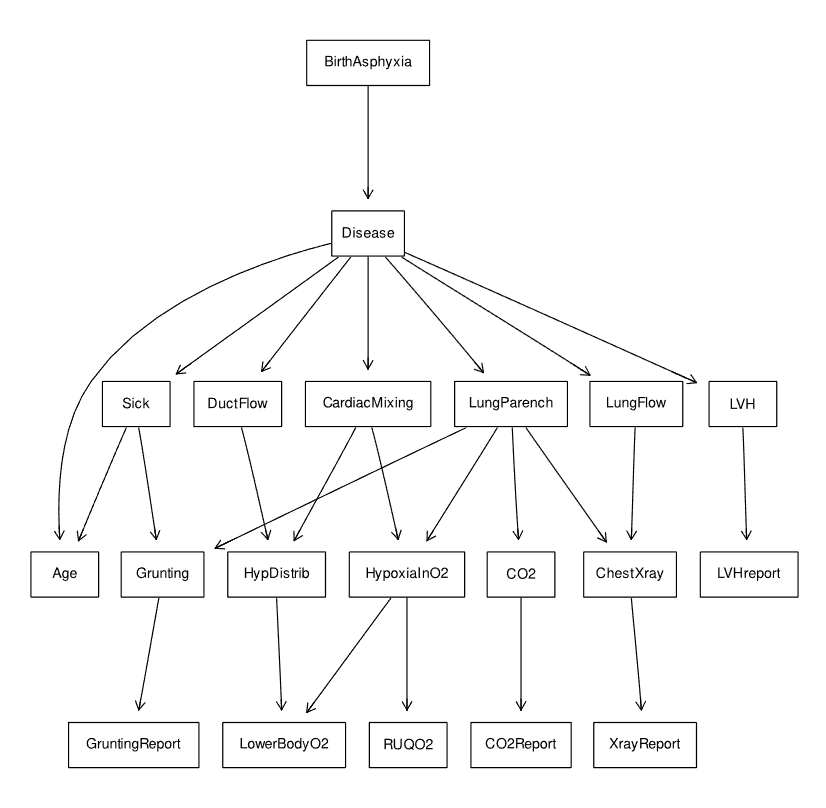
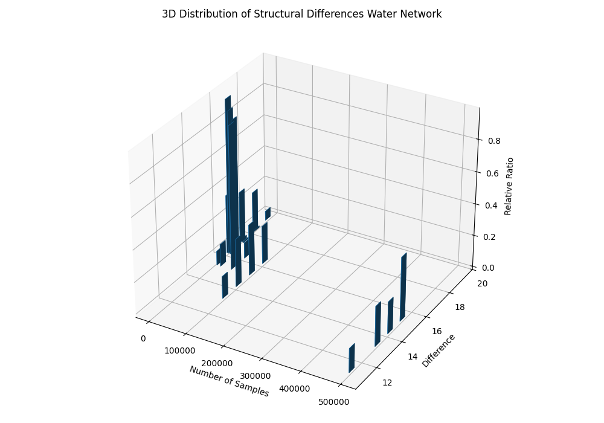
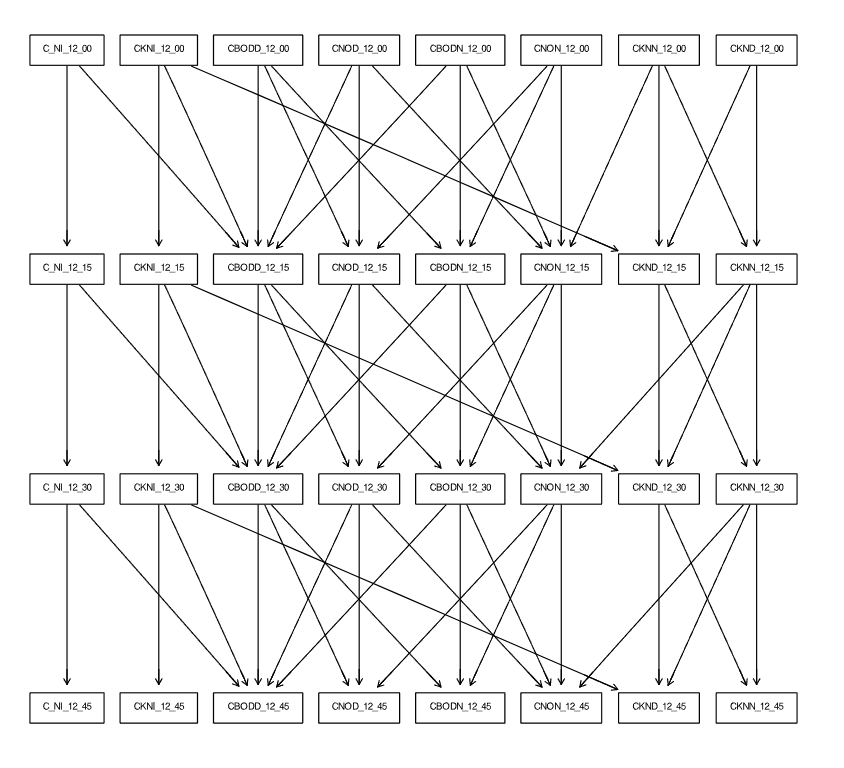

# Implementation of K2 Procedure to Find the Most Probable Belief-Network Structures

**Author**: Alessio Bocini

## Abstract

This document presents an implementation of the K2 procedure for learning Bayesian network structures, as required for the Artificial Intelligence course. The algorithm follows the assumptions and structure proposed by Cooper and Herskovits, including the original scoring function. The implementation is demonstrated using a Python-based approach and evaluated on a sample dataset.

---

## Table of Contents

- [Introduction](#introduction)
- [Implementation](#implementation)
  - [unique_instantiations](#unique_instantiations)
  - [j_th_unique_instantiation](#j_th_unique_instantiation)
  - [Pred](#pred)
  - [Nijk](#nijk)
  - [Nij](#nij)
  - [cooper_herskovits_score](#cooper_herskovits_score)
  - [K2 Procedure](#k2-procedure)
- [Functional and Unit Testing](#functional-and-unit-testing)
- [Findings: Empirical Behavior of the K2 Procedure](#findings-empirical-behavior-of-the-k2-procedure)
- [Version History](#version-history)
- [References](#references)

---

## Introduction

The K2 procedure is a heuristic-search method, proposed by Cooper and Herskovits [1], used in Bayesian network structure learning to determine the most likely network from a dataset of variables. It applies a greedy search approach to build the structure by adding parent nodes to each variable, optimizing based on a scoring function.

The algorithm evaluates possible parent sets for each variable, incrementally adding nodes that maximize the likelihood until no further improvement is possible. It simplifies the complex task of network learning by focusing on maximizing the posterior probability of the structure given the data, while adhering to a predefined node ordering.





**Theorem from Cooper & Herskovits**:

Let \( Z \) be a set of \( n \) discrete variables. Each variable \( x_i \in Z \) has \( r_i \) possible values. Let \( D \) be a dataset of \( m \) cases.

- \( \pi_i \): parent set of \( x_i \)
- \( W_{ij} \): \( j \)-th unique instantiation of \( \pi_i \)
- \( N_{ijk} \): number of cases in which \( x_i = v_k \) and \( \pi_i = W_{ij} \)
- \( N_{ij} = \sum_k N_{ijk} \)

Then:
```math
P(B_s, D) = P(B_s) \prod_i \prod_j \left[ \frac{(r_i - 1)!}{(N_{ij} + r_i - 1)!} \prod_k N_{ijk}! \right]```


## Implementation

Each part of the K2 algorithm was implemented as an independent function:

1. `unique_instantiations(xi, parents_xi, data)`
2. `j_th_unique_instantiation(xi, parents_xi, j, data)`
3. `Pred(xi, nodes)`
4. `Nijk(xi, j, k, parents_xi, data)`
5. `Nij(xi, parents_xi, j, data)`
6. `cooper_herskovits_score(xi, parents_xi)`
7. `k2_procedure(ordering)`

Data is represented as a `pandas.DataFrame`, where each column corresponds to a discrete variable.

---

### unique_instantiations(xi, parents_xi, data)

Finds all unique instantiations (value combinations) of the parent variables \( \pi_i \) of node \( x_i \).  
If no parents are defined, it returns an empty collection. The function:

- selects the parent columns
- removes duplicates
- returns the combinations \( W_{ij} \), where \( q_i = |W_{ij}| \)

---

### j_th_unique_instantiation(xi, parents_xi, j, data)

Returns the \( j \)-th instantiation \( W_{ij} \) of parent set \( \pi_i \), using the result of `unique_instantiations()`.

---

### Pred(xi, nodes)

Returns all variables that precede \( x_i \) in the topological ordering.  
Used to restrict candidate parents to only earlier nodes.

---

### Nijk(xi, j, k, parents_xi, data)

Computes \( N_{ijk} \): the number of cases in the dataset where:

- \( x_i = v_k \)
- the parent variables \( \pi_i \) match the \( j \)-th instantiation \( W_{ij} \)

---

### Nij(xi, parents_xi, j, data)

Computes \( N_{ij} \), defined as:

```math
N_{ij} = \sum_{k=1}^{r_i} N_{ijk}```

Counts how many cases match the \( j \)-th parent instantiation, regardless of the value of \( x_i \).  
This value \( N_{ij} \) is needed to compute the denominator in the Cooper-Herskovits scoring formula.

---

### cooper_herskovits_score(xi, parents_xi)

This function computes the Cooper-Herskovits score \( g(x_i, \pi_i) \) for a given node \( x_i \) and its parent set \( \pi_i \).  
The formula used is:

```math
g(i, \pi_i) = \prod_{j=1}^{q_i} \left[ \frac{(r_i - 1)!}{(N_{ij} + r_i - 1)!} \prod_{k=1}^{r_i} N_{ijk}! \right]```

However, computing factorials of large values directly can lead to **overflow** or **underflow** errors.

To overcome this, the formula is rewritten using the **logarithmic gamma function** (`loggamma`), which is more numerically stable.  
This relies on the identity:

```math
\log(n!) = \log\Gamma(n + 1)```

Thus, the Cooper-Herskovits score becomes:

```math
\log g(i, \pi_i) = \sum_{j=1}^{q_i} \left[ \log\Gamma(r_i) - \log\Gamma(N_{ij} + r_i) + \sum_{k=1}^{r_i} \log\Gamma(N_{ijk} + 1) \right]```
This log-domain version preserves the theoretical definition while enabling stable and efficient computation.

### Why This Matters

- **Large numbers become manageable**: Products become sums, reducing the risk of numeric instability.
- **Avoids overflow/underflow**: Essential for datasets with large counts or many variables.
- **Improved precision**: Especially valuable when comparing competing structures with small score differences.
- **Theoretically exact**: The log-transformed version is mathematically equivalent to the original formula.

The implementation uses `mpmath.loggamma()` to compute \(\log\Gamma(\cdot)\) with arbitrary precision, ensuring correctness even at high sample sizes.

---

### K2 Procedure

The K2 algorithm applies the scoring function to iteratively construct the network structure.  
It respects a given topological ordering and uses a greedy strategy to choose parent sets.

**Procedure:**

1. For each variable \( x_i \) (in the given ordering):
   - Initialize \( \pi_i = \emptyset \)
   - Compute current score \( g(x_i, \pi_i) \)
2. While adding a predecessor improves the score:
   - Add the parent that leads to the largest increase in \( g(x_i, \pi_i) \)
3. Finalize \( \pi_i \) and move to the next node

**Original pseudocode from the paper:**


**Python implementation:**



---

## Functional and Unit Testing

To ensure correctness and robustness of the implementation, a comprehensive test suite was developed using Python’s `unittest`.

### Functions Tested

- `unique_instantiations()` — Verified correctness for empty, single, and multiple parents
- `j_th_unique_instantiation()` — Verified for deterministic index access
- `Nijk()` — Confirmed correct row filtering and value counting
- `Nij()` — Checked that \(\sum_k N_{ijk} = N_{ij}\)
- `Pred()` — Validated against predefined orderings

Also verified:

- Consistency of variable value sets \( V \)
- Cardinality vector \( r \) computation

### Unit Test Results



---

### Functions Not Directly Unit Tested

- `cooper_herskovits_score()`  
  Skipped due to difficulty in verifying exact numerical outputs by hand.  
  Its correctness was verified indirectly through:
  - Observing monotonic score behavior
  - Empirical convergence during experiments

- `k2_procedure()`  
  Not tested through unit tests due to its global, non-deterministic behavior.  
  Instead, assessed through real-world benchmark experiments (Child and Water networks).

---

## Findings: Empirical Behavior of the K2 Procedure

To evaluate how well the K2 algorithm performs in practice, experiments were conducted on two well-known benchmark Bayesian networks:

- The **Child** network
- The **Water** network

For both cases, the goal was to measure how close the learned structure is to the ground-truth DAG, as a function of dataset size.

---

### Child Network

**Sample Sizes**: 1000, 5000, 50000, 100000  
For each sample size:

- The structure was learned using the K2 procedure
- The absolute structural difference (number of incorrect/missing/extra edges) from the expected DAG was computed
- The distribution of these differences was recorded over multiple trials

**Result Visualization**:



**Ground-truth DAG**:



**Observation**:

- With small sample sizes (e.g. 1000), the structural differences vary widely (commonly 4+)
- At 5000 samples, differences decrease and become concentrated near 1 or 2
- At 50000 and 100000 samples, most reconstructions differ by at most 1 edge, and often match exactly

This confirms the **convergence behavior** of the K2 algorithm:  
> Given a good node ordering and sufficient data, the learned structure approaches the true one.

---

### Water Network

**Sample Sizes**: 1000, 5000, 10000, 20000, 50000, 100000, 500000  
Same evaluation method as with the Child network.

**Result Visualization**:



**Ground-truth DAG**:



**Observation**:

- Structural differences are higher overall (commonly between 16–19 at low sample sizes)
- As the sample size increases to 100k and 500k, differences gradually reduce (toward 11–15 range)
- The convergence is **slower and less stable** compared to the Child network

**Possible causes**:

- Higher complexity of the Water network
- Suboptimal or non-optimal node ordering
- More subtle dependencies between variables

---

### Interpretation

The results align well with theoretical expectations:

- **Correct ordering + large dataset ⇒ high-quality structure reconstruction**
- The **Child** network demonstrates this clearly
- The **Water** network shows slower convergence, but still improves with more data

A critical implementation detail that enabled these results was the use of the `loggamma`-based scoring function. Without it, large-sample experiments would have been **computationally unstable** or **impossible**.

---

## Version History

- **April 2024** – Initial draft of the K2 implementation and basic experiments.
- **September 2024** – Refactored code and introduced unit tests.
- **November 2024** – Implemented `loggamma` and tested on the Water network.
- **March 2025** – Ran large-scale experiments with increasing sample sizes.
- **April 2025** – Finalized report and documentation.

---

## References

1. Cooper, G. F., & Herskovits, E. (1992). *A Bayesian Method for the Induction of Probabilistic Networks from Data*. Machine Learning.
2. Barber, D. (2012). *Bayesian Reasoning and Machine Learning*. Cambridge University Press.
3. Russell, S., & Norvig, P. (2020). *Artificial Intelligence: A Modern Approach*.

---


